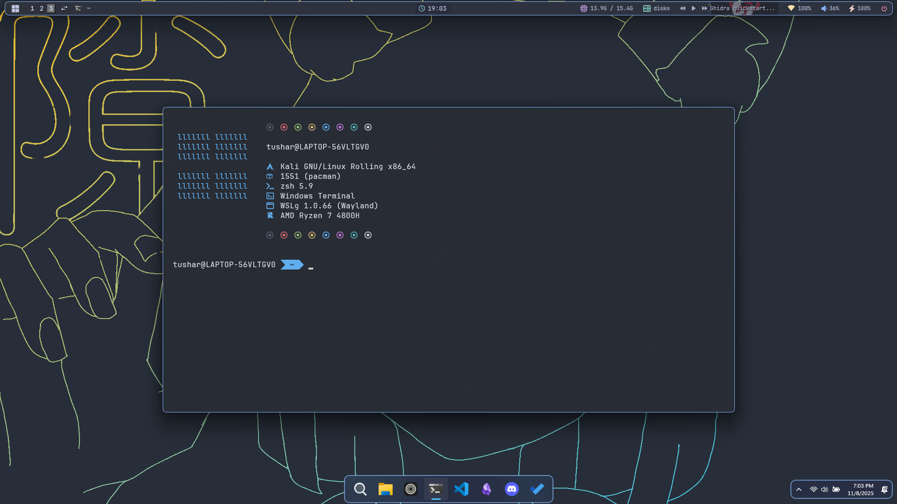
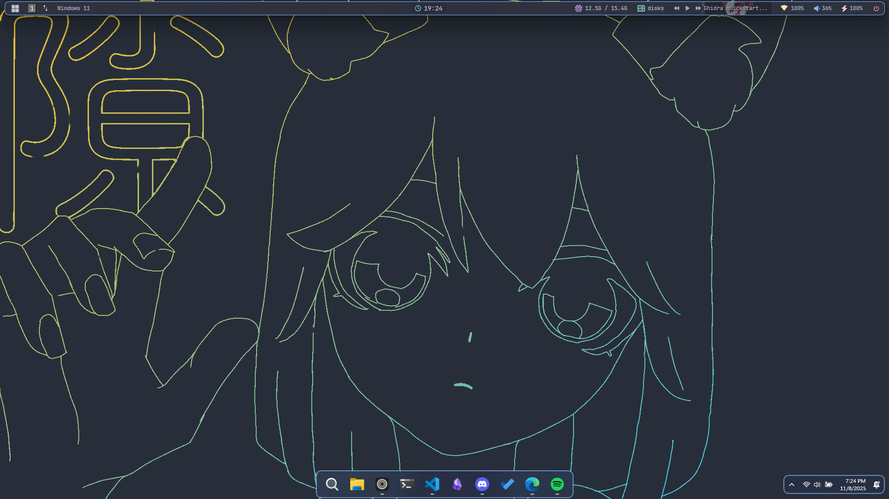
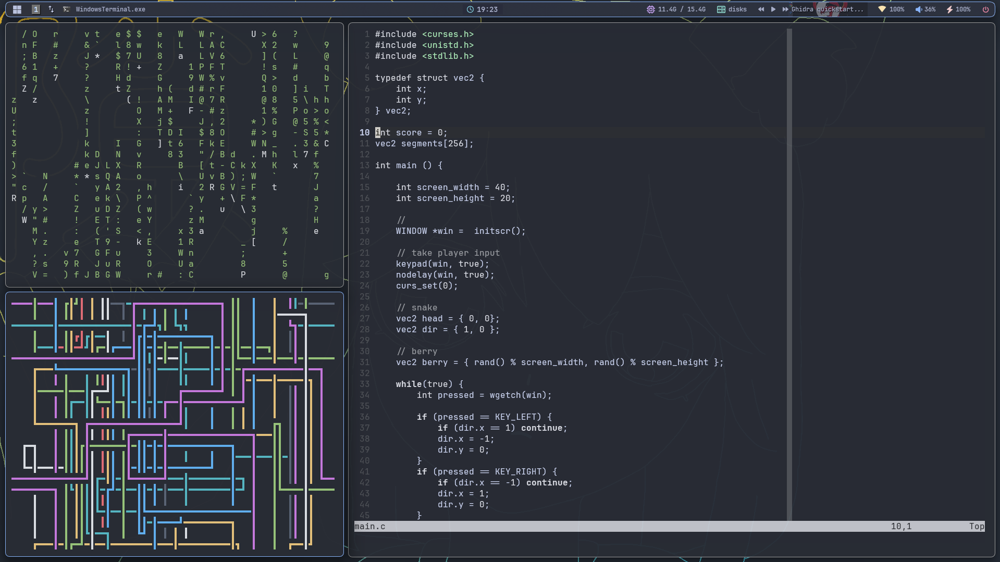
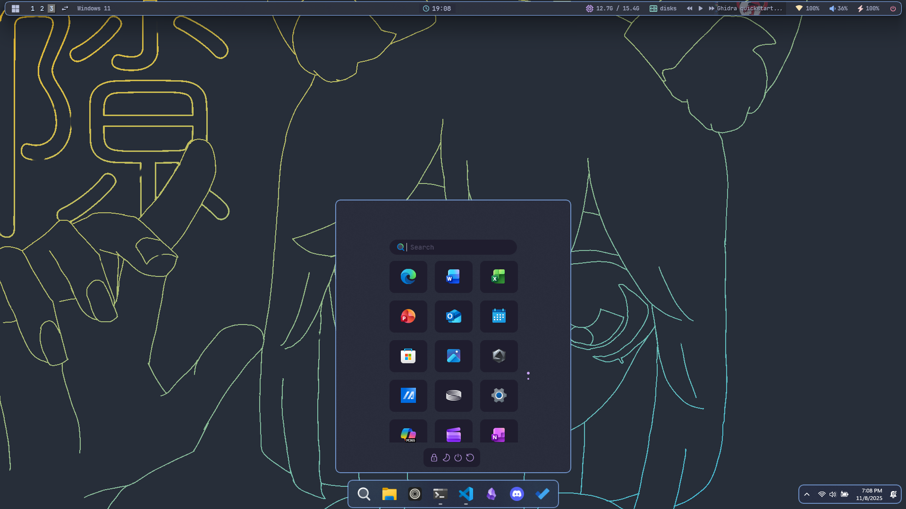
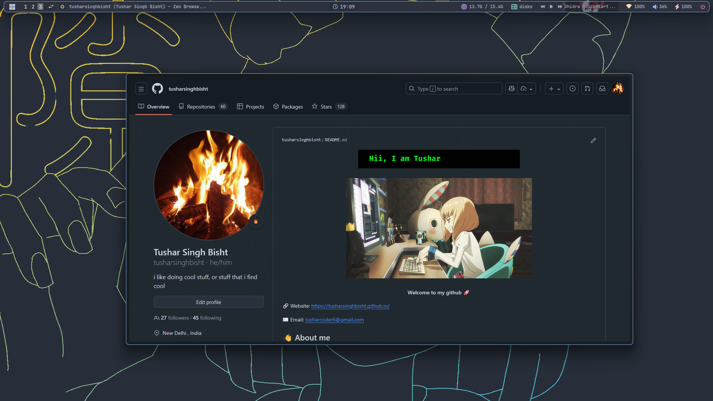

# Windots 🪟

  

  
  

  
  

Dotfiles and configuration for my Windows-11 setup.
(ofc windows needs to be customized :])

### Features
- VSCode settings
- Windows Terminal configuration
- Glazewm for tiling window management
- yasb for top bar
- windhawk for taskbar and start menu customization
- WSL2 with Kali Linux and ZSH as the main shell.

### Utilities 

| Utility | Application |
|---------|-------------|
| 🌐 Browser | Zen         |
| 📝 Text Editor | VSCode, Neovim |
| 🐚 Terminal | Windows Terminal |
| 🪟 Window Manager | Glazewm    |
| ✒️ Notes   | Obsidian    |
| 🎵 Music   | Spotify with Spicetify |

🌟Shoutout to [https://github.com/ashish0kumar/windots](https://github.com/ashish0kumar/windots) for help and inspiration.

Thanks for having a look! <3
Feel free to reach out if you have any questions or suggestions.

[aabisht2006@gmail.com](mailto:aabisht2006@gmail.com)
